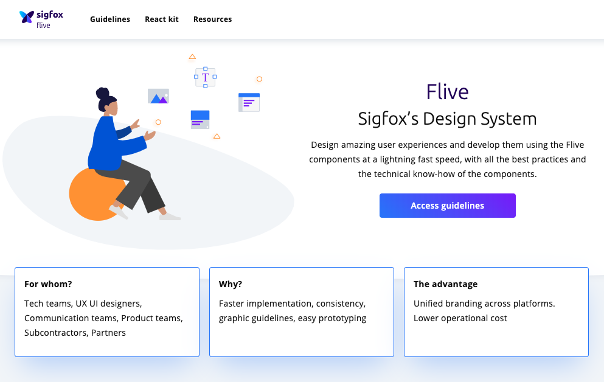

Hi there!

In the web engineering team [@sigfox](https://www.npmjs.com/org/sigfox), we love trying new technologies, and Gatsby was surely on the list of interesting things to discover.

To know more about the context, we've been working for some time on designing and implementing company's Design System from the ground up. My contributions to **Flive** (as it's been named) have been relatively modest so far as I have been working on the move to [Kubernetes](https://kubernetes.io) of our web platforms. But it's been very interesting to work on this project nonetheless with such a great collaboration between designers & developers!

Every good project that aims at being used company-wide needs to be properly documented though. And here comes **Gatsby**!!! And I can tell you, I'm definitely in love! 😍

> Above is part of the Flive Design System homepage

It's been of a great help, speeding up development drastically. Its plugin architecture & ecosystem is very extensive and quite easy to apprehend.

As examples, we are doing automatic documentation generation from code using [JSDoc](https://devdocs.io/jsdoc) & the [gatsby-transformer-react-docgen](https://www.npmjs.com/package/gatsby-transformer-react-docgen) plugin. We are also able to use custom React components in Markdown thanks to [gatsby-plugin-mdx](https://www.npmjs.com/package/gatsby-plugin-mdx). I'm just naming a few here, you can achieve lots of things thanks to plugins.

All this motivated me to start making a static website of my own using *Gatsby*, and here we are!

But now, at almost 2am, it's definitely time to sleep... 😴

Bye!
